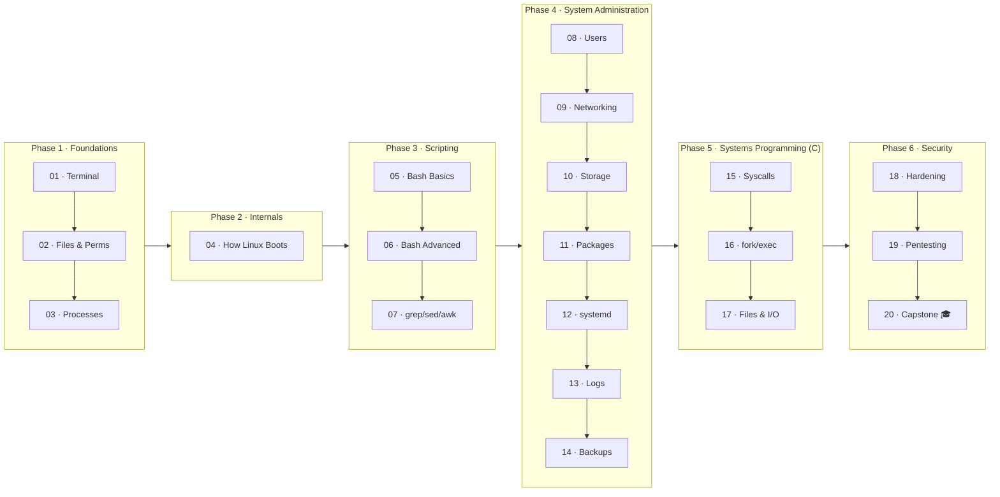
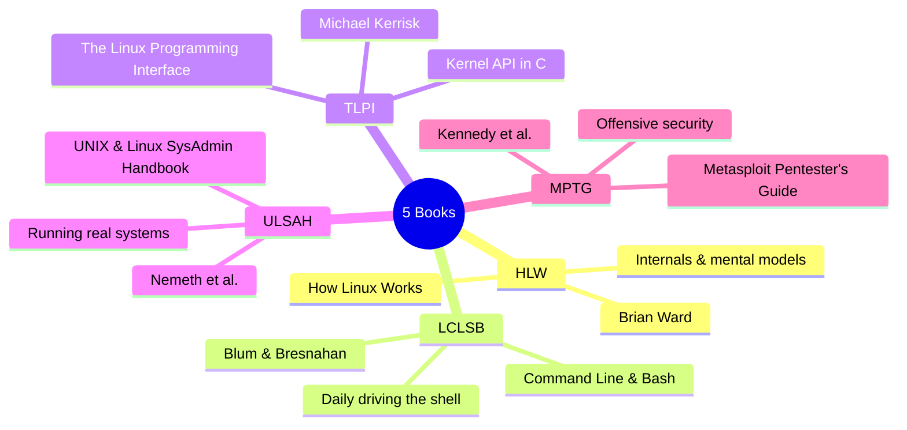

# Linux Mastery — A 12-Month Self-Study Course

A structured, beginner-friendly path from "I've opened a terminal" to "I understand how Linux really works."
Built around five classic books, designed for ~3 hours/week.

```
┌───────────────────────────────────────────────────────────────────────┐
│                                                                       │
│   MONTH:  1   2   3   4   5   6   7   8   9   10  11  12              │
│   PHASE: [Foundations ][Boot][ Scripting ][   SysAdmin   ][SysProg][Sec]│
│   YOU →  ░░░░░░░░░░░░░░░░░░░░░░░░░░░░░░░░░░░░░░░░░░░░░░░░░░░░░░░  🎓 │
│                                                                       │
└───────────────────────────────────────────────────────────────────────┘
```

## 🗺️ Visual roadmap



> 💡 If your viewer doesn't render Mermaid, open this README on GitHub or in any Markdown viewer with Mermaid support (VS Code, Obsidian, etc.). All diagrams below are Mermaid.

---

## How this course works

You read **chapters from real books** (the ones you already have), then come here to do **exercises** that lock the knowledge in. Each module is one focused topic, about 2–4 weeks of casual study.

This repo doesn't replace the books — it guides you through them and gives you hands-on practice. You learn Linux by *using* Linux, not by reading about it.

### The five books you'll use

| Short name | Full title |
|---|---|
| **HLW** | How Linux Works — Brian Ward |
| **LCLSB** | Linux Command Line and Shell Scripting Bible — Blum & Bresnahan |
| **TLPI** | The Linux Programming Interface — Michael Kerrisk |
| **ULSAH** | UNIX and Linux System Administration Handbook — Nemeth et al. |
| **MPTG** | Metasploit: The Penetration Tester's Guide — Kennedy et al. |

Throughout the modules, readings are referenced like: `LCLSB ch.3` or `HLW §2.4`.

---

## Before you start

You need a Linux system to practice on. Pick one:

- **Best:** A virtual machine running Ubuntu or Debian (use VirtualBox, UTM on Mac, or VMware). You can break things safely.
- **Good:** WSL2 on Windows (Ubuntu).
- **OK:** A cheap VPS ($5/month from Hetzner, DigitalOcean, etc.) — bonus: you also learn remote work via SSH.
- **Avoid for now:** Using your main daily-driver Linux machine. You'll be experimenting and breaking things on purpose.

See [`resources/setup-your-lab.md`](resources/setup-your-lab.md) for a full setup guide.

---

## 📚 The five books at a glance



---

## The roadmap

### Phase 1 — Foundations (Months 1–2)
You learn to live in the terminal. By the end you should be comfortable navigating, manipulating files, and not panicking when something looks weird.

- **Module 01** — Terminal basics
- **Module 02** — Files and permissions
- **Module 03** — Processes and jobs

### Phase 2 — How Linux actually works (Month 3)
You stop seeing Linux as magic. You understand what happens between power-on and login prompt.

- **Module 04** — How Linux boots

### Phase 3 — Bash scripting (Months 4–5)
The single most leveraged skill on Linux. Once you can script, you can automate anything.

- **Module 05** — Shell scripting basics
- **Module 06** — Shell scripting advanced
- **Module 07** — Text processing (grep, sed, awk)

### Phase 4 — System administration (Months 6–8)
You can now manage a real Linux system: users, networks, disks, services, logs.

- **Module 08** — Users and groups
- **Module 09** — Networking
- **Module 10** — Storage and filesystems
- **Module 11** — Package management
- **Module 12** — Services and systemd
- **Module 13** — Logging and monitoring
- **Module 14** — Backups and automation

### Phase 5 — Systems programming (Months 9–10)
You write C programs that talk to the kernel directly. This is where Linux stops being a black box.

- **Module 15** — Systems programming intro
- **Module 16** — Processes and signals
- **Module 17** — Files and I/O

### Phase 6 — Security (Months 11–12)
Now that you understand the system, you can learn how to defend it — and how it gets attacked.

- **Module 18** — Security fundamentals
- **Module 19** — Intro to pentesting
- **Module 20** — Capstone projects

---

## How to use each module

Every module has the same structure:

```
module-XX-name/
├── README.md          # what you'll learn, readings, weekly plan
├── notes/             # your own notes (template provided)
├── exercises/         # tasks to complete
└── solutions/         # check your work AFTER you try
```

The workflow for each module:

1. **Read** the assigned chapters from the book(s).
2. **Take notes** in `notes/` — your own words, what clicked, what didn't.
3. **Do the exercises** in `exercises/`. Struggle a bit before peeking.
4. **Check** your work against `solutions/`.
5. **Commit** your progress to git. (Yes, you'll learn git through using it.)
6. **Update** [`progress/tracker.md`](progress/tracker.md).

---

## Time commitment

About 3 hours per week, roughly:

- 90 min — reading
- 60 min — exercises
- 30 min — notes and review

If you fall behind: that's fine. This is a marathon. Skip the deadline, not the work.

---

## A few rules

1. **Type every command yourself.** Don't copy-paste from the book. Your fingers learn too.
2. **Read `man` pages.** When a command is new, `man command` is your friend. Even partially. Even if it's confusing.
3. **Break things on purpose.** The VM exists to be destroyed and rebuilt.
4. **Don't memorize. Understand.** If you understand *why*, you'll re-derive the *how*.
5. **Commit often.** Even tiny progress. The graph keeps you honest.

---

## Where to start

→ [`module-01-terminal-basics/README.md`](module-01-terminal-basics/README.md)

Good luck. You'll be surprised how far you get in a year.
