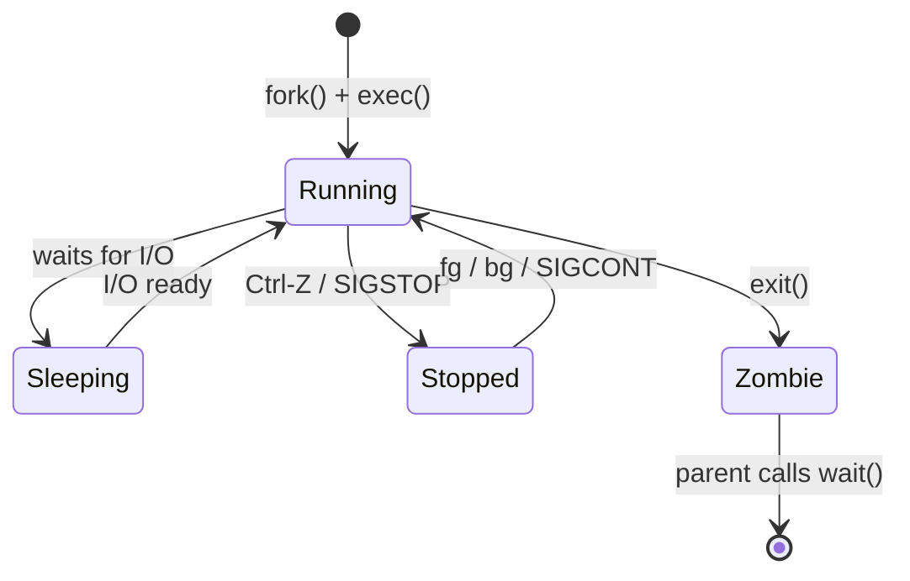
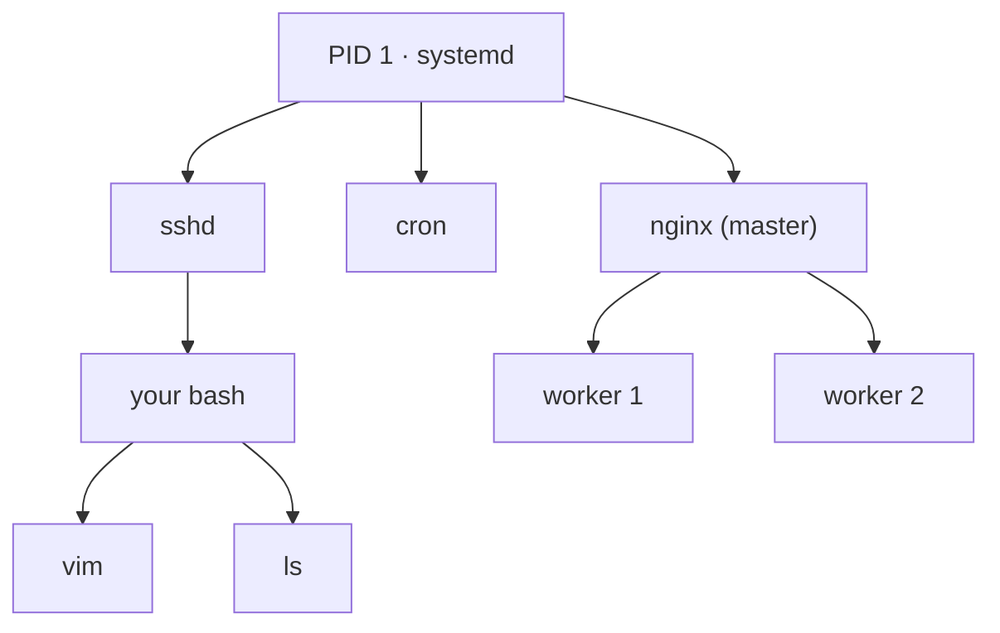

# Module 03 — Processes and Jobs

**Phase:** Foundations · **Time:** ~2 weeks · **Prereq:** Module 02

---

## 🔄 The life of a process



## 📡 Common signals — the cheat card

```
┌─────────┬─────┬─────────────────────────────────────────────┐
│ SIGINT  │  2  │ Ctrl-C — "please stop"                      │
│ SIGTSTP │ 20  │ Ctrl-Z — suspend (resumable)                │
│ SIGTERM │ 15  │ default kill — "please clean up and exit"   │
│ SIGHUP  │  1  │ terminal closed / "reload your config"      │
│ SIGKILL │  9  │ unblockable, ungraceful — "die now"         │
│ SIGCONT │ 18  │ "continue if stopped"                       │
└─────────┴─────┴─────────────────────────────────────────────┘
```

> 🧠 `kill` is a misnomer — it just sends a signal. `kill -9` is the nuclear option because SIGKILL can't be caught or handled.

## 🌲 The process tree



---

## What you'll learn

- What a process is and how to see what's running
- Foreground vs background; jobs vs processes
- Signals (SIGTERM, SIGKILL, SIGHUP, SIGINT) — how to talk to processes
- Process tree: parents, children, init/systemd
- Resource usage: CPU, memory, watching live with `top`/`htop`

## Readings

| Priority | Book | Chapter |
|---|---|---|
| Required | **HLW** | Ch. 8 — A Closer Look at Processes and Resource Utilization |
| Required | **LCLSB** | Ch. 4 — More Bash Shell Commands (process section) |
| Recommended | **ULSAH** | Ch. 4 — Process Control |

## Key concepts

1. **A process is a running program.** Every process has a PID, a parent PID, a user, and state.
2. **PID 1 is special.** It's `init` or `systemd`. All other processes descend from it.
3. **Signals are tiny messages** sent between processes. `kill` is misnamed — it sends signals; one of them happens to terminate.
4. **`Ctrl-C` sends SIGINT. `Ctrl-Z` suspends. `bg` and `fg` manage jobs.**
5. **`&` at the end of a command runs it in the background.**

## Exercises

In `exercises/`:
- List all processes belonging to you with `ps`
- Run a long-lived command (`sleep 300`), suspend it, background it, foreground it, kill it
- Use `top` and `htop` — watch them, sort by CPU/memory
- Use `pgrep`, `pkill`, `kill` with different signals
- Run `nohup` so a process survives terminal close
- Trace a process's parent chain with `ps` and `pstree`

## Done when...

- You're not afraid to kill a process
- You understand why `kill -9` is "the last resort" and not the default
- `ps aux | grep something` is in your muscle memory

→ [Module 04](../module-04-how-linux-boots/README.md)
