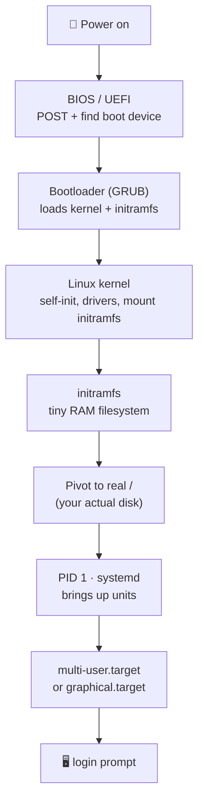

# Module 04 — How Linux Boots

**Phase:** How Linux actually works · **Time:** ~3 weeks · **Prereq:** Module 03

---

## ⚡ Power-on → login prompt



## 🎯 systemd targets at a glance

```
emergency.target   →  single shell, no services       (rescue mini)
rescue.target      →  single user, basic services
multi-user.target  →  full system, no GUI             (servers live here)
graphical.target   →  multi-user + display manager    (your laptop)
```

## 🛠️ Boot-debug toolbox

| When boot fails… | Reach for |
|---|---|
| Kernel can't start | edit GRUB entry with `e`, add `init=/bin/sh` |
| Services hang | `systemd-analyze blame`, `systemd-analyze critical-chain` |
| Cryptic kernel msg | `dmesg`, `journalctl -k -b` |
| Last boot's logs | `journalctl -b -1` |

---

## What you'll learn

- The boot sequence end-to-end: BIOS/UEFI → bootloader → kernel → init → login
- What the kernel actually does in those first seconds
- GRUB basics — and how to fix a broken boot
- The role of systemd as the modern init system
- initramfs: the kernel's "first filesystem"

## Readings

| Priority | Book | Chapter |
|---|---|---|
| Required | **HLW** | Ch. 5 — How the Linux Kernel Boots |
| Required | **HLW** | Ch. 6 — How User Space Starts |
| Recommended | **HLW** | Ch. 3 — Devices (skim) |
| Recommended | **ULSAH** | Ch. 2 — Booting and System Management Daemons |

## Key concepts

1. **The kernel doesn't start with a usable filesystem.** It uses an `initramfs` — a tiny in-memory filesystem — to get going.
2. **systemd is PID 1** on most modern distros. It launches everything else.
3. **A "target" in systemd is roughly what a "runlevel" used to be** — a set of services to bring up (graphical.target, multi-user.target).
4. **`dmesg` shows kernel messages** from boot and after. Goldmine for debugging.
5. **GRUB is configurable, fragile, and editable at boot time** by pressing `e` in the menu.

## Exercises

In `exercises/`:
- Read your own boot log with `dmesg` and `journalctl -b`
- List all systemd units, find one that's running, look at its file
- Boot into single-user mode (or rescue mode) from GRUB — practice on the VM
- Identify your bootloader's config file
- Time your boot with `systemd-analyze`

## Done when...

- You can describe what happens between power-on and login prompt in your own words
- `systemctl status` doesn't intimidate you
- You know how to recover when boot fails

→ [Module 05](../module-05-shell-scripting-basics/README.md)
