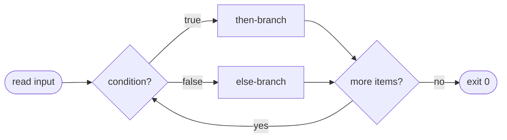

# Module 05 — Shell Scripting Basics

**Phase:** Bash scripting · **Time:** ~3 weeks · **Prereq:** Module 04

---

## 🧬 Anatomy of a bash script

```
┌────────────────────────────────────────────────────┐
│ #!/bin/bash             ← shebang: which interpreter│
│                                                    │
│ name="${1:-world}"      ← argument with default    │
│                                                    │
│ if [[ -z "$name" ]]; then                          │
│   echo "no name" >&2    ← write to stderr          │
│   exit 1                ← non-zero = failure       │
│ fi                                                 │
│                                                    │
│ echo "hello, $name"     ← stdout (default)         │
└────────────────────────────────────────────────────┘
   make executable:  chmod +x hello.sh
   run it:           ./hello.sh Alice
```

## 🔀 Control flow at a glance



## 🚰 Streams & redirection

```
   stdin (0) ──→ ┌─────────┐ ──→ stdout (1)
                 │ program │
                 └─────────┘ ──→ stderr (2)

   echo hi  >  out.txt      # stdout to file (overwrite)
   echo hi  >> out.txt      # stdout to file (append)
   cmd  2>  err.log         # stderr to file
   cmd  &>  all.log         # both
   cmd1 |   cmd2            # stdout of cmd1 → stdin of cmd2
```

---

## What you'll learn

- Writing your first scripts: shebang, permissions, execution
- Variables, quoting, command substitution
- Conditionals (`if`, `[ ]`, `[[ ]]`, `test`)
- Loops (`for`, `while`, `until`)
- Reading user input, arguments (`$1`, `$@`, `$#`)
- Exit codes — the foundation of script reliability

## Readings

| Priority | Book | Chapter |
|---|---|---|
| Required | **LCLSB** | Ch. 11 — Basic Script Building |
| Required | **LCLSB** | Ch. 12 — Using Structured Commands |
| Required | **LCLSB** | Ch. 13 — More Structured Commands |
| Required | **LCLSB** | Ch. 14 — Handling User Input |

## Key concepts

1. **A shell script is just a file with commands.** Plus a shebang (`#!/bin/bash`) and execute permission.
2. **Quoting matters more than you think.** `"$var"` vs `$var` vs `'$var'` — different behaviors. Master this early.
3. **Exit code 0 means success.** Anything else means failure. Conditionals use this.
4. **Pipelines and redirection** (`|`, `>`, `>>`, `<`, `2>`, `&>`) are bash's superpower.
5. **`$()` for command substitution.** Old style: backticks. Use `$()`.

## Exercises

In `exercises/` — you'll build progressively:
- A "hello, who are you" script that takes input
- A backup script that copies a directory with a timestamp
- A "is this file an image?" classifier based on extension
- A loop that processes every `.txt` file in a folder
- A script that takes command-line arguments and validates them

## Done when...

- You can write a 20-line bash script from scratch
- You instinctively quote your variables
- You check exit codes when it matters
- `man bash` is no longer terrifying (just intimidating)

→ [Module 06](../module-06-shell-scripting-advanced/README.md)
