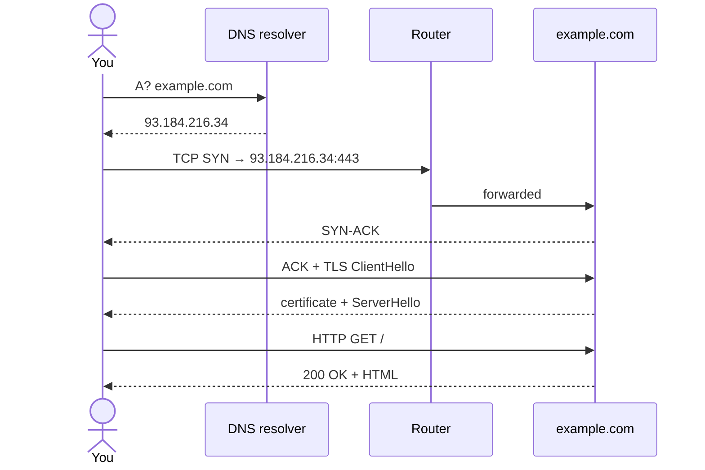

# Module 09 — Networking

**Phase:** System administration · **Time:** ~3 weeks · **Prereq:** Module 08

---

## 🧱 The TCP/IP layer cake

```
┌─────────────────────────────────────────────────────────────┐
│  Application      │ HTTP, SSH, DNS, SMTP    │  curl, ssh    │
├───────────────────┼─────────────────────────┼───────────────┤
│  Transport        │ TCP / UDP   + ports     │  ss, netstat  │
├───────────────────┼─────────────────────────┼───────────────┤
│  Internet         │ IP    + routing         │  ip route     │
├───────────────────┼─────────────────────────┼───────────────┤
│  Link             │ Ethernet, Wi-Fi, MAC    │  ip link      │
└─────────────────────────────────────────────────────────────┘
```

## 🌐 What happens when you `curl https://example.com`



## 🩺 "I can't reach the server" — debug ladder

```
  1. ip a              → do I have an IP?
  2. ip route          → do I have a default gateway?
  3. ping 8.8.8.8      → can I reach the internet by IP?
  4. dig example.com   → does DNS resolve?
  5. curl -v https://… → does TLS / app layer work?
  6. ss -tlnp          → on the server: is the port listening?
  7. sudo ufw status   → is the firewall blocking me?
```

---

## What you'll learn

- TCP/IP basics: IP addresses, ports, subnets, gateways
- Inspecting your network: `ip`, `ss`, `ping`, `traceroute`, `dig`
- DNS resolution: `/etc/hosts`, `/etc/resolv.conf`, `dig`, `nslookup`
- SSH: keys, config, port forwarding
- Firewalls: `iptables` basics, `ufw` (the friendly frontend)
- Network troubleshooting workflow

## Readings

| Priority | Book | Chapter |
|---|---|---|
| Required | **HLW** | Ch. 9 — Understanding Your Network and Its Configuration |
| Required | **ULSAH** | Ch. 13 — TCP/IP Networking |
| Recommended | **ULSAH** | Ch. 14 — Physical Networking (skim) |
| Recommended | **ULSAH** | Ch. 27 — Security (sections on SSH) |

## Key concepts

1. **An IP address belongs to an interface, not a host.** A machine can have many.
2. **Ports are how multiple services share one IP.** Port 22 is SSH by convention, not by law.
3. **DNS is just translation.** It turns names into IPs. When something feels broken, it's often DNS.
4. **SSH keys are way better than passwords.** Learn this early.
5. **`ip` replaces `ifconfig`. `ss` replaces `netstat`.** The old commands still work most places, but learn the new ones.

## Exercises

In `exercises/`:
- Inspect your interfaces, routing table, listening ports
- Look up `anthropic.com` via DNS in 3 different ways
- Generate SSH keys, put your pubkey on a remote host (or local VM), log in passwordlessly
- Configure your `~/.ssh/config` with aliases
- Use `ufw` to allow only SSH and HTTP, deny everything else
- Set up SSH local port forwarding to access a service through a jump host

## Done when...

- You can debug "I can't reach this server" with confidence
- You never type your password to SSH again
- You understand the difference between `0.0.0.0`, `127.0.0.1`, and your real IP

→ [Module 10](../module-10-storage-and-filesystems/README.md)
