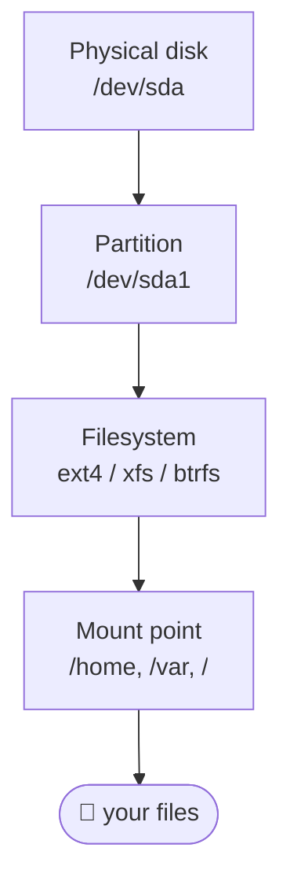

# Module 10 — Storage and Filesystems

**Phase:** System administration · **Time:** ~2 weeks · **Prereq:** Module 09

---

## 🧱 The four storage layers



```
   lsblk     →  shows disks + partitions  (layers 1–2)
   blkid     →  shows filesystem types     (layer 3)
   mount     →  shows what's mounted where (layer 4)
   df -h     →  free space per filesystem
   du -sh *  →  size of each thing here
```

## 📄 /etc/fstab — line dissected

```
UUID=abc-123-…   /data    ext4    defaults,noatime   0   2
       │           │       │           │             │   │
   what to mount  where  fstype      options        dump fsck-order
                                                          (0=skip, 1=root, 2=others)
```

> ⚠️ Always identify by **UUID** (or LABEL), not `/dev/sdb1` — device names can shuffle on reboot.

## 🧅 Optional LVM stack (when you want flexibility)

```
   PV  Physical Volume   →  raw disk / partition (e.g. /dev/sdb1)
   VG  Volume Group      →  pool of PVs
   LV  Logical Volume    →  slice of the VG → formatted with a filesystem
```

---

## What you'll learn

- Disks, partitions, filesystems — three different things
- `df`, `du`, `lsblk`, `blkid`, `mount`, `/etc/fstab`
- Filesystem types: ext4, xfs, btrfs, tmpfs, swap
- Creating, mounting, and persisting a new disk
- LVM (Logical Volume Manager) basics
- Swap and when to use it

## Readings

| Priority | Book | Chapter |
|---|---|---|
| Required | **HLW** | Ch. 4 — Disks and Filesystems |
| Required | **ULSAH** | Ch. 20 — Storage |
| Recommended | **HLW** | Ch. 4 sections on LVM |

## Key concepts

1. **Disk → partition → filesystem → mount point.** Four layers.
2. **`df` is "disk free" (filesystem usage). `du` is "disk usage" (per file/dir).** Different numbers.
3. **`/etc/fstab` is what makes mounts persistent across reboots.** Edit carefully.
4. **A "filesystem" is a structure imposed on a partition.** ext4 ≠ xfs ≠ btrfs — different tradeoffs.
5. **Inodes can run out** even when disk space is free. `df -i` shows them.

## Exercises

In `exercises/`:
- Map your disk layout: physical disks → partitions → filesystems → mount points
- Add a virtual disk to your VM, partition it, format it, mount it, persist it in fstab
- Use `du` to find what's eating your disk space
- Create and use a tmpfs (RAM-backed filesystem)
- Add and remove swap

## Done when...

- You can walk someone through adding a new disk to a server
- You don't get scared by fstab
- You can answer "why is my disk full?" with confidence

→ [Module 11](../module-11-package-management/README.md)
