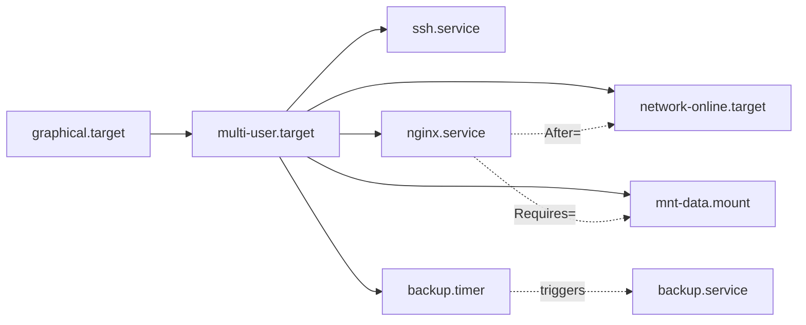
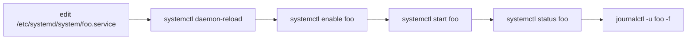

# Module 12 — Services and systemd

**Phase:** System administration · **Time:** ~2 weeks · **Prereq:** Module 11

---

## 🧩 The systemd universe



```
   Unit types you'll meet:
     .service  → daemons / one-shot programs
     .timer    → scheduled triggers (cron's modern cousin)
     .mount    → filesystem mounts
     .target   → group of units (= old "runlevels")
     .socket   → on-demand activation
```

## 📝 A minimal .service file — annotated

```
[Unit]
Description=My backup job
After=network-online.target            ← order: start AFTER network
Requires=network-online.target         ← hard dep: fail if missing

[Service]
Type=oneshot                           ← runs, exits, done
ExecStart=/usr/local/bin/backup.sh
User=backup                            ← drop privileges!

[Install]
WantedBy=multi-user.target             ← what 'enable' hooks into
```

## 🔁 Daily systemctl flow



> ⚠️ **Forgetting `daemon-reload` after editing a unit is the #1 systemd footgun.**

---

## What you'll learn

- The systemd model: units, targets, dependencies
- Writing your own `.service` unit
- Timers — modern replacement for cron
- `systemctl` mastery
- `journalctl` — the systemd journal

## Readings

| Priority | Book | Chapter |
|---|---|---|
| Required | **HLW** | Ch. 6 — How User Space Starts (systemd sections) |
| Required | **ULSAH** | Ch. 2 — Booting and System Management Daemons |
| Recommended | **ULSAH** | Ch. 10 — Logging |

## Key concepts

1. **A unit is a configuration file** that describes something systemd manages: a service, mount, timer, target.
2. **Units have dependencies** (`After=`, `Requires=`, `Wants=`). They form a graph.
3. **`systemctl daemon-reload`** is required after editing unit files. Forget this and you'll be confused.
4. **The journal is structured, not just text.** Filter by unit, priority, time, user.
5. **Timers > cron for new work.** Cron is fine; systemd timers are more powerful (and journaled).

## Exercises

In `exercises/`:
- Write a simple service: a bash script + a `.service` file
- Make it start on boot
- Watch its logs with journalctl
- Write a timer that runs your service every 5 minutes
- Override a system service unit without editing the original
- Filter journals by time, priority, and unit

## Done when...

- You can write a unit file from memory
- You debug a failed service with `systemctl status` + `journalctl -u <unit>` reflexively
- You stop using `&` and `nohup` for things that should be services

→ [Module 13](../module-13-logging-and-monitoring/README.md)
