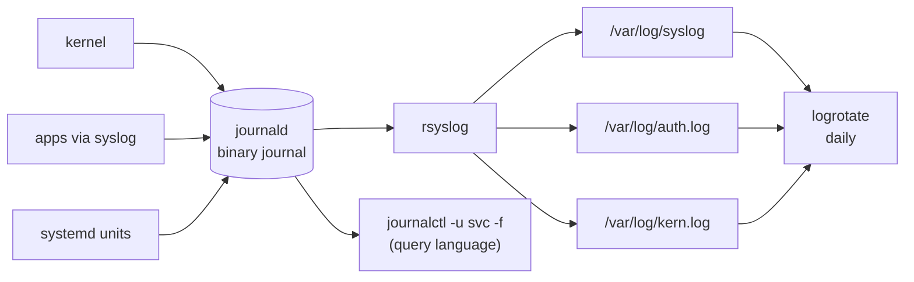

# Module 13 — Logging and Monitoring

**Phase:** System administration · **Time:** ~2 weeks · **Prereq:** Module 12

---

## 📜 How logs flow on a modern Linux box



## 🩻 "What's slow?" — the tool ladder

```
   load average ↑ ?            →  uptime, top
   which process is hot CPU?   →  top  (P), htop
   memory pressure?            →  free -h, vmstat 1
   disk I/O wait?              →  iostat -xz 1, iotop
   network saturation?         →  iftop, nload, ss -s
   what is THIS pid doing?     →  strace -p PID, lsof -p PID
```

## 🔁 The logrotate idea

```
  app.log  (live)
     │  every day
     ▼
  app.log.1                ← yesterday
  app.log.2.gz             ← compressed
  app.log.3.gz
  …
  app.log.14.gz            ← oldest kept (14d)
                              older = deleted
```

---

## What you'll learn

- The Linux logging landscape: syslog, journald, application logs
- `/var/log` — what's where and why
- Log rotation (`logrotate`) — keeping logs from eating your disk
- Live monitoring: `top`, `htop`, `iotop`, `iftop`, `vmstat`, `sar`
- The "What's slow on this box?" workflow

## Readings

| Priority | Book | Chapter |
|---|---|---|
| Required | **ULSAH** | Ch. 10 — Logging |
| Required | **HLW** | Ch. 7 — Section on logging |
| Recommended | **HLW** | Ch. 8 — Process resource utilization (revisit) |
| Recommended | **ULSAH** | Ch. 28 — Performance Analysis (if you want more) |

## Key concepts

1. **Two logging worlds coexist**: the older `/var/log/*.log` text files (managed by rsyslog) and the newer systemd journal.
2. **Rotation prevents disk blowup.** logrotate runs daily via cron or systemd timer.
3. **Different bottlenecks need different tools.** CPU, memory, disk I/O, network — each has its own command.
4. **Don't tail-and-pray.** Learn to filter logs by time and severity.

## Exercises

In `exercises/`:
- Find auth, kernel, and apt logs on your system
- Configure logrotate for a custom log file
- Use `top`/`htop` and explain what every column means
- Identify a disk-I/O bottleneck with `iotop` / `iostat`
- Use `vmstat 1` to watch system pulse
- Write a script that emails you if disk usage > 90%

## Done when...

- You know where to look when something feels wrong
- You can read a `top` screen and form a hypothesis
- Disk-full incidents stop surprising you

→ [Module 14](../module-14-backups-and-automation/README.md)
