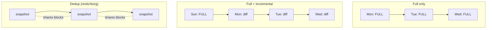

# Module 14 — Backups and Automation

**Phase:** System administration · **Time:** ~2 weeks · **Prereq:** Module 13

---

## 🛡️ The 3-2-1 rule

```
  ┌────────────────────────────────────────────────────┐
  │   3   copies of your data                          │
  │   2   different media (e.g. local disk + cloud)    │
  │   1   off-site (fire, theft, ransomware survive)   │
  └────────────────────────────────────────────────────┘

       💻  ──→  💾 (local)
            ╲
             ╲──→  ☁️  (offsite, encrypted)
```

> 🔥 **An untested backup is not a backup.** Schedule restore drills, not just backups.

## 🧮 Backup strategies compared



## ⏰ cron vs systemd timer

```
   cron                              systemd timer
   ─────────────────                 ─────────────────────────
   * * * * *  cmd                    OnCalendar=*-*-* *:*:00
   easy & ubiquitous                 journaled, dependencies,
   tiny syntax to memorize           accurate after sleep,
   no logs by default                Persistent=true catches up
```

```
   ┌── min  (0-59)
   │ ┌── hour (0-23)
   │ │ ┌── day-of-month
   │ │ │ ┌── month
   │ │ │ │ ┌── day-of-week (0=Sun)
   │ │ │ │ │
   * * * * *  /path/to/cmd
```

---

## What you'll learn

- Backup philosophy: 3-2-1 rule, full vs incremental, what to back up
- Tools: `tar`, `rsync`, `restic`, `borg`
- Off-site backups
- Cron (still useful) vs systemd timers
- Automating common admin tasks

## Readings

| Priority | Book | Chapter |
|---|---|---|
| Required | **ULSAH** | Ch. 12 — Storage (backup sections) |
| Recommended | **HLW** | Ch. 7 — Section on cron and timers |
| Recommended | **LCLSB** | Ch. 16 — Script Control (scheduling) |

## Key concepts

1. **An untested backup is not a backup.** Restore drills matter more than the backup itself.
2. **3-2-1 rule:** 3 copies, 2 different media, 1 offsite.
3. **`rsync` is the swiss army knife.** `--archive --delete --hard-links --acls --xattrs`.
4. **`restic` and `borg`** do deduplication, encryption, and incremental backups properly. Use one of them for real backups.
5. **Cron syntax:** `min hour dom month dow` — minute, hour, day-of-month, month, day-of-week.

## Exercises

In `exercises/`:
- Use rsync to mirror a directory locally and to a remote host
- Set up a cron job (then re-do it with a systemd timer)
- Configure restic or borg with a local repo
- Practice a restore (this is the part everyone skips!)
- Write an automation script for a tedious task you do often

## Done when...

- You have a backup setup for your VM
- You've successfully *restored* from a backup, not just backed up
- Cron and timers feel interchangeable

→ [Module 15](../module-15-systems-programming-intro/README.md)
