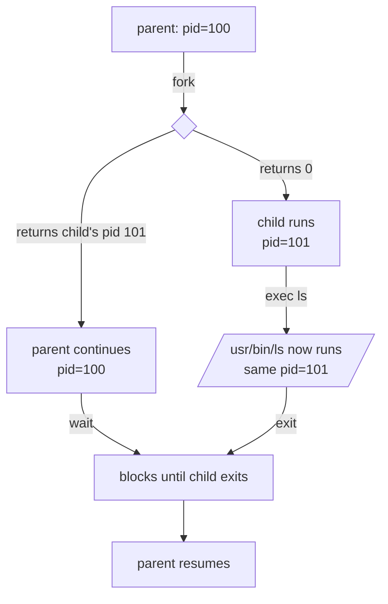

# Module 16 — Processes and Signals (in C)

**Phase:** Systems programming · **Time:** ~3 weeks · **Prereq:** Module 15

---

## 🍴 fork() returns twice — the mind-bender



```c
pid_t pid = fork();
if (pid == 0)         { /* child  */ execvp("ls", argv); }
else if (pid > 0)     { /* parent */ wait(NULL); }
else                  { /* error  */ perror("fork"); }
```

## 🧟 The zombie lifecycle

```
   child: exit(42)
        │
        ▼
   ┌────────────────┐
   │ ZOMBIE         │  ← exit status sits in process table,
   │ (no resources, │     waiting for parent to read it
   │  just a slot)  │
   └───────┬────────┘
           │  parent calls wait() / waitpid()
           ▼
       reaped — slot freed
```

> If the parent **never** waits → permanent zombies → eventually exhaust PIDs. If the parent **dies first** → child is reparented to PID 1 (which waits for everybody).

## 📡 Signal-handler safety

```
   Inside a signal handler, you may only call
   "async-signal-safe" functions (write, _exit, signal, ...).

   ❌  printf, malloc, fprintf  ← NOT safe — buffers, locks
   ✅  write(STDOUT_FILENO, ...)  ← safe — direct syscall
```

---

## What you'll learn

- `fork()`, `exec()`, `wait()` — how Linux really starts processes
- The fork/exec model — why a shell does it this way
- Signal handlers in C — catch SIGINT, set up cleanup
- Process groups and sessions (basics)
- Why this matters: this is what your shell does every time you press Enter

## Readings

| Priority | Book | Chapter |
|---|---|---|
| Required | **TLPI** | Ch. 24 — Process Creation |
| Required | **TLPI** | Ch. 25 — Process Termination |
| Required | **TLPI** | Ch. 27 — Program Execution |
| Required | **TLPI** | Ch. 20 — Signals: Fundamental Concepts |
| Recommended | **TLPI** | Ch. 21 — Signals: Signal Handlers |

## Key concepts

1. **`fork()` returns twice.** Once in the parent (with the child's PID), once in the child (with 0). Mind-bending until it isn't.
2. **`exec()` replaces the current process with a new program.** The PID stays the same. This is why your shell can run any command without spawning a "shell helper."
3. **A child becomes a zombie until the parent calls `wait()`.** Zombies hold the exit status. Forgetting to wait → leaks.
4. **Signal handlers run *asynchronously*.** They must use only async-signal-safe functions. Subtle bugs live here.
5. **The fork/exec model is *the* Unix design choice.** Windows does it differently (`CreateProcess`).

## Exercises

In `exercises/`:
- Write a program that forks and prints from both parent and child
- Use `wait()` to collect the child's exit status
- Write a mini shell: read a line, fork+exec it, wait
- Install a SIGINT handler that ignores the first Ctrl-C
- Demonstrate a zombie process (and how to clean it up)

## Done when...

- You can write a fork/exec/wait sequence from scratch
- You understand why Ctrl-C in your terminal kills the foreground process
- You can explain what a zombie is

→ [Module 17](../module-17-files-and-io/README.md)
