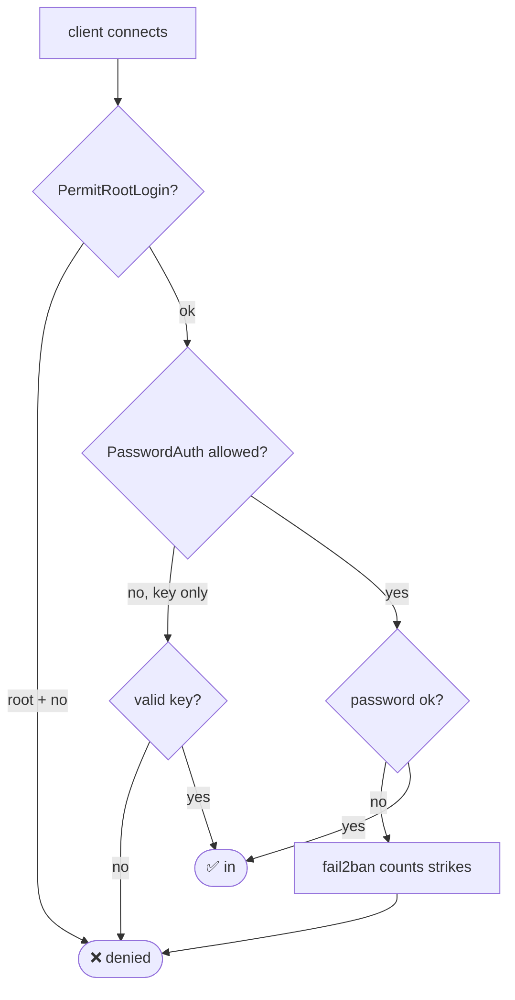

# Module 18 — Security Fundamentals (Defensive)

**Phase:** Security · **Time:** ~3 weeks · **Prereq:** Module 17

---

## 🧅 Defense in depth — the onion

```
            ┌────────────────────────────────────┐
            │     Physical / cloud account       │
            │  ┌──────────────────────────────┐  │
            │  │   Network: firewall, VPN     │  │
            │  │  ┌────────────────────────┐  │  │
            │  │  │  Host: SSH keys, patch │  │  │
            │  │  │ ┌──────────────────┐   │  │  │
            │  │  │ │ App: input val.  │   │  │  │
            │  │  │ │ ┌──────────────┐ │   │  │  │
            │  │  │ │ │ Data: 🔒 enc.│ │   │  │  │
            │  │  │ │ └──────────────┘ │   │  │  │
            │  │  │ └──────────────────┘   │  │  │
            │  │  └────────────────────────┘  │  │
            │  └──────────────────────────────┘  │
            └────────────────────────────────────┘
            One layer fails → others still hold.
```

## 🔐 SSH login decision flow



## ✅ The hardening checklist

```
   [ ] SSH:  key-only, no root, non-standard port? optional
   [ ] firewall: default deny, allow only what's needed
   [ ] fail2ban for SSH (and any other public service)
   [ ] unattended-upgrades / automatic patching
   [ ] sudoers: per-user, no NOPASSWD: ALL
   [ ] no secrets in env / shell history / git
   [ ] audit: auditd, lynis scan, regular log review
   [ ] backups (you reviewed them, right?)
```

---

## What you'll learn

- The threat model: who, what, why
- Hardening: SSH, firewall, fail2ban, sudo policies
- File integrity, auditd, AppArmor/SELinux basics
- Authentication: passwords, keys, 2FA, PAM
- Secret management: never put credentials in code or `~/.bash_history`
- Common attacks and how to prevent them

## Readings

| Priority | Book | Chapter |
|---|---|---|
| Required | **ULSAH** | Ch. 27 — Security |
| Required | **HLW** | Ch. 7 — Section on users/security |
| Recommended | **ULSAH** | Ch. 9 — Cloud Computing (security sections) |

## Key concepts

1. **Defense in depth.** Multiple layers — if one fails, others catch it.
2. **Principle of least privilege.** Every user and process gets only what it needs.
3. **Logs are evidence.** Centralize them, retain them, rotate them.
4. **Patches matter most.** Most breaches exploit known, patched vulnerabilities.
5. **Humans are the weakest link.** Most "hacks" are phishing or weak passwords.

## Exercises

In `exercises/`:
- Harden SSH: key-only auth, no root login, custom port, fail2ban
- Configure ufw for a typical web server (22, 80, 443 in; everything else out)
- Install and configure fail2ban
- Set up password aging and complexity policies
- Audit your VM with `lynis`
- Find and disable unnecessary services

## Done when...

- Your VM passes a lynis audit reasonably well
- You can list 10 things you'd do to harden a fresh Ubuntu server
- You know what to log and what to monitor

→ [Module 19](../module-19-intro-to-pentesting/README.md)
